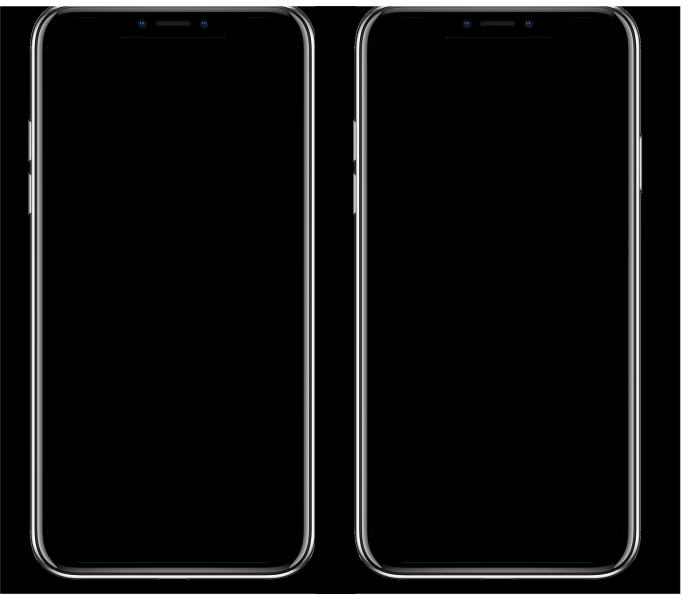

# TODO LIST

This application was built to help people keep their to-do lists well organized, with it you can organize your to-do and completed tasks.




### 📋 Prerequisites

This project was developed in typescript with react-native and expo, to run it you must have node.js and any emulator installed on your computer.

```
Install NODE.JS
Install Emulator

```

### 🔧 to install

To install, just clone the directory on your computer, run the yarn command to install the dependencies and finally, to run the project, just run the yarn start command

```
yarn
yarn start
```

## 📌 Version

1.0 

## ✒️ Autor

Marcus Vinicius Oliveira Pepinelli 2023

